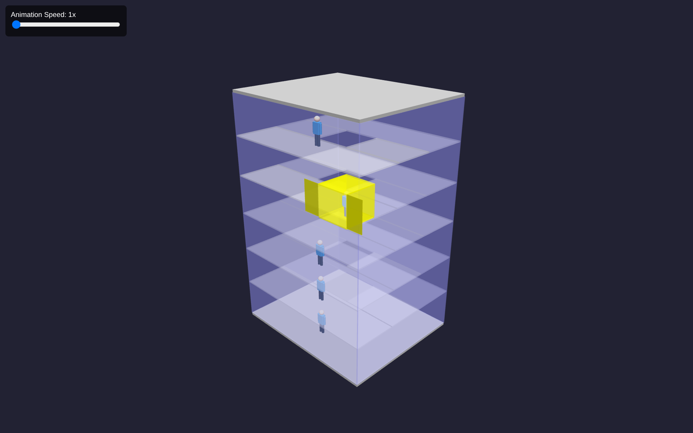
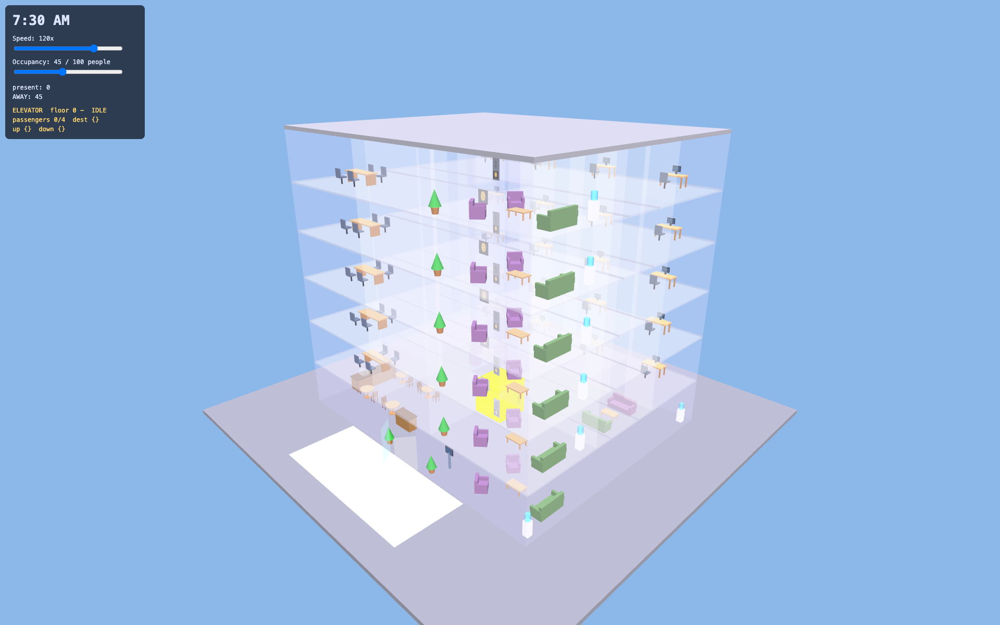

# LLM Agent Evaluation Suite 🚀

**[View the live dashboard](https://jeffgrover.github.io/llm-eval/)**

This suite provides tools to automate the benchmarking of agentic CLI tools against both local LLMs (via LM Studio) and cloud API providers (Anthropic, Google, Groq, Cerebras, etc.). It captures detailed performance metrics, server logs, command outputs, and generated artifacts, then builds self-contained run reports plus a scored comparison dashboard.

## Reference Implementations

The best results produced so far for each prompt. Click a preview to launch the live simulation.

| [Elevator Simulation](reference/elevator/index.html) | [Office Building Simulation](reference/office/index.html) |
| :---: | :---: |
| [](reference/elevator/index.html) | [](reference/office/index.html) |

## Current Benchmark Focus

- **Elevator prompt**: the main local-model benchmark. It asks agents to build a browser-only Three.js elevator simulation.
- **Office prompt / office prompt v2**: the main frontier/cloud benchmark. It asks agents to build a richer office-day simulation with persistent agents, schedules, navigation, and elevator behavior.

The generated dashboard keeps these prompt families separate so local elevator runs and frontier office runs can be compared without one burying the other.

## 1. LM Studio Setup

First, you'll need a platform to host your local models.

1.  **Download LM Studio**: Visit [lmstudio.ai](https://lmstudio.ai/) and install the latest version.
2.  **Turn on API Server**:
    -   Open LM Studio and navigate to the **Local Server** (↔️) tab.
    -   Click **Start Server**. This exposes an OpenAI-compatible API at `http://localhost:1234/v1`.
3.  **Hardware Tips**:
    -   **Recommended RAM**: 16 GB - 32 GB of free GPU RAM is ideal for the 20B-30B parameter models listed below.
    -   **Quantization**: Use 4-bit or 8-bit quantized models to maximize performance on consumer GPUs.

### Recommended Models
Search for these models in the LM Studio "Search" tab to download them:

-   `mistralai-devstral-small-2-24b-instruct-2512`
-   `zai-org/glm-4.6v-flash`
-   `qwen/qwen3-vl-30b`
-   `qwen3-coder-30b-a3b-instruct`
-   `gpt-oss-20b`
-   `google/gemma-3-27b`
-   `microsoft/phi-4-reasoning-plus`

---

## 2. Agent CLI Installation

Install the agents you wish to evaluate. Each has its own setup requirements:

| Agent | CLI Name | Setup Instructions |
| :--- | :--- | :--- |
| **Mistral Vibe** | `vibe` | [mistralai/mistral-vibe](https://github.com/mistralai/mistral-vibe) |
| **Claude Code** | `claude` | [Anthropic Claude Code Docs](https://docs.anthropic.com/en/docs/agents-and-tools/claude-code) |
| **Codex CLI** | `codex` | [OpenAI Codex CLI](https://github.com/openai/codex) |
| **Gemini CLI** | `gemini` | [google-gemini/gemini-cli](https://github.com/google-gemini/gemini-cli) |
| **Crush** | `crush` | [charmbracelet/crush](https://github.com/charmbracelet/crush) |
| **OpenCode** | `opencode` | [opencode-ai/opencode](https://github.com/opencode-ai/opencode) |
| **Pi Coding Agent** | `pi` | [badlogic/pi-mono](https://github.com/badlogic/pi-mono/tree/main/packages/coding-agent) |

---

## 3. Running Evaluations

Once LM Studio is running and your agent is installed, you can perform an experiment.

### Basic Command
Run the evaluation script by specifying the model key (as it appears in `lms ls`) and the agent type:

```bash
./evaluate_agent.py --model <model-key> --agent vibe --prompt-file prompt.txt
```

### Parameters
-   `--model`: The LM Studio model identifier (or cloud model name when using `--non-local`).
-   `--agent`: One of `vibe`, `gemini`, `claude`, `codex`, `opencode`, `crush`, or `pi`.
-   `--prompt-file`: Path to a text file containing the initial prompt for the agent.
-   `--non-local`: (Optional) Skip LM Studio and use the agent's default cloud provider instead.
-   `--headless`: (Optional) Run in headless mode (defaults to True).

The script will automatically create a uniquely named workspace in `evals/`, capture all logs, detect generated scripts, and run them to capture `OUTPUT.TXT`.

### Codex CLI
Codex currently runs through your ChatGPT account service, so use it with `--non-local`:

```bash
./evaluate_agent.py --model gpt-5.5 --agent codex --prompt-file elevator_prompt.txt --non-local
```

Codex runs are saved with `CHAT_SESSION.TXT`, raw `CODEX_EVENTS.JSONL`, `CODEX_LAST_MESSAGE.TXT`, and aggregated token metrics in `CODEX_RESULT.JSON`.

---

## 4. Exploring Results

After running one or more experiments, generate the centralized dashboard to browse and compare results.

1.  **Generate Index**:
    ```bash
    ./generate_index.py
    ```
2.  **View Dashboard**: Open the generated `index.html` in your favorite browser, or visit the **[live dashboard on GitHub Pages](https://jeffgrover.github.io/llm-eval/)**.
    ```bash
    open index.html
    ```

The dashboard starts with reference previews and then provides three tabs:

-   **Elevator Prompt Scores**: deterministic scores and comparisons for elevator prompt runs.
-   **Office Prompt Scores**: deterministic scores and comparisons for office prompt runs.
-   **By Agent**: the catalog view grouped by agent, with provider, prompt, score, and report links.

The scoring is intentionally deterministic. It does not claim to be a full qualitative judge; it rewards reproducible signals such as:

-   required files and expected script structure
-   browser readiness for no-build Three.js artifacts
-   prompt-specific implementation cues
-   run completion and machine-readable result metrics
-   token/turn efficiency

Click **View Report** on any card to see the full breakdown, including:
-   **Prompt Trace**: Exactly what was sent (including newlines).
-   **Token Metrics**: Input/Output tokens and TPS (Tokens Per Second).
-   **Software Env**: Versions of LMS, CLI, and Hardware specs.
-   **Artifact Viewer**: Side-by-side view of generated code, server logs (`SERVER.LOG`), and execution results (`OUTPUT.TXT`).

---

## Technical Details

-   **Report Isolation**: Reports use base64 encoding for artifacts, meaning they are completely self-contained and don't require a local web server to view.
-   **Naming Convention**: Directories are segmented as `evals/{agent}_{model}_{prompt}` for easy searching.
-   **Dashboard Regeneration**: `generate_index.py` is dependency-free and writes the static `index.html` home page.
